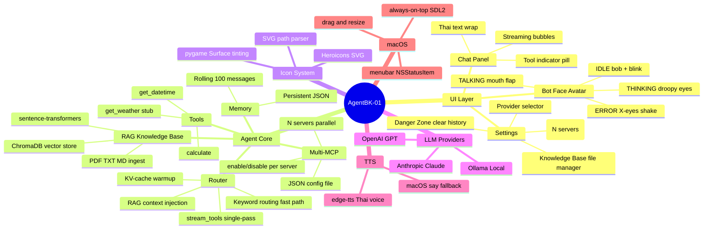
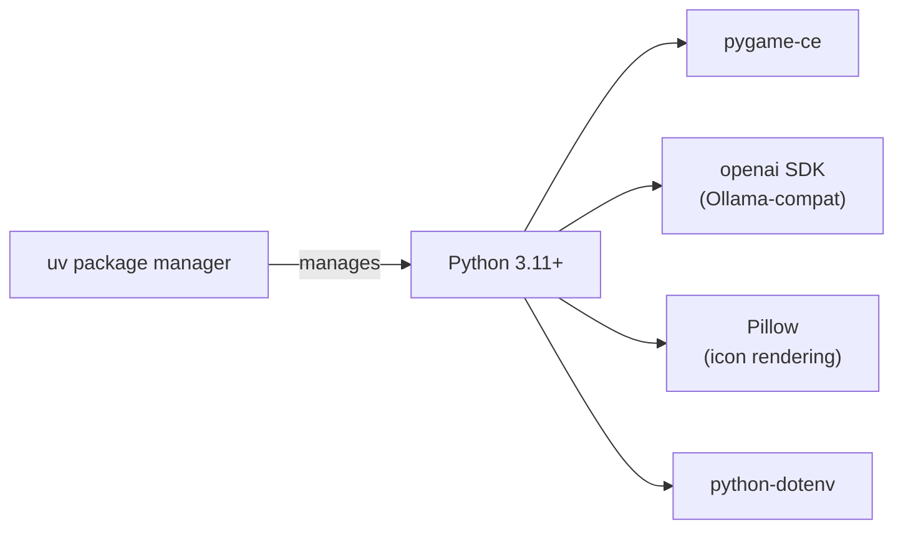
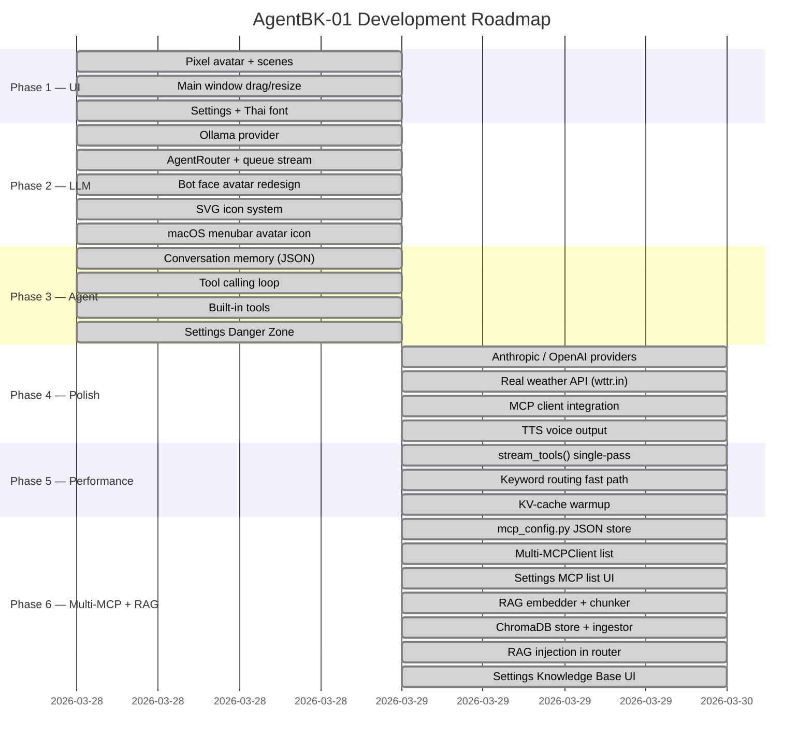

# AgentBK-01 — Documentation Index

> Desktop AI Bot พร้อม Pixel Avatar สำหรับ macOS/PC พัฒนาด้วย Python

---

## เอกสารทั้งหมด

| ไฟล์ | เนื้อหา |
|------|---------|
| [01-architecture.md](./01-architecture.md) | System architecture, component diagram, data flow |
| [02-ui-design.md](./02-ui-design.md) | Layout, visual design, color system, UI states |
| [03-avatar-system.md](./03-avatar-system.md) | Bot face avatar, animation states, rendering pipeline |
| [04-llm-providers.md](./04-llm-providers.md) | Provider pattern, adapter interface, tool calling |
| [05-dev-guide.md](./05-dev-guide.md) | Setup, conventions, workflow, testing |
| [06-agent-tools.md](./06-agent-tools.md) | Conversation memory, built-in tools, tool loop |
| [07-mcp-rag.md](./07-mcp-rag.md) | Multi-MCP config, RAG knowledge base, vector search |

---

## ภาพรวมโปรเจกต์

---

## Tech Stack

---

## สถานะโปรเจกต์

| Phase | เนื้อหา | สถานะ |
|-------|---------|-------|
| Phase 1 | UI — avatar, scenes, drag/resize, Thai font | ✅ Done |
| Phase 2 | LLM providers, AgentRouter, bot face avatar, SVG icons, menubar icon | ✅ Done |
| Phase 3 | Conversation memory, tool calling, built-in tools, Danger Zone | ✅ Done |
| Phase 4 | Real weather API, Anthropic/OpenAI providers, MCP client, TTS | ✅ Done |
| Phase 5 | Performance — stream_tools(), keyword routing, KV-cache warmup | ✅ Done |
| Phase 6 | Multi-MCP (N servers, JSON config) + RAG knowledge base (ChromaDB + sentence-transformers) | ✅ Done |

