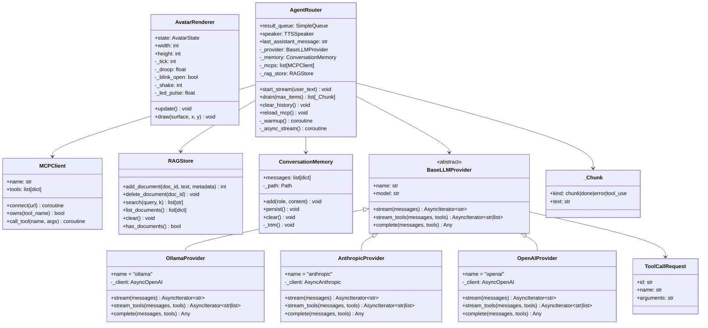
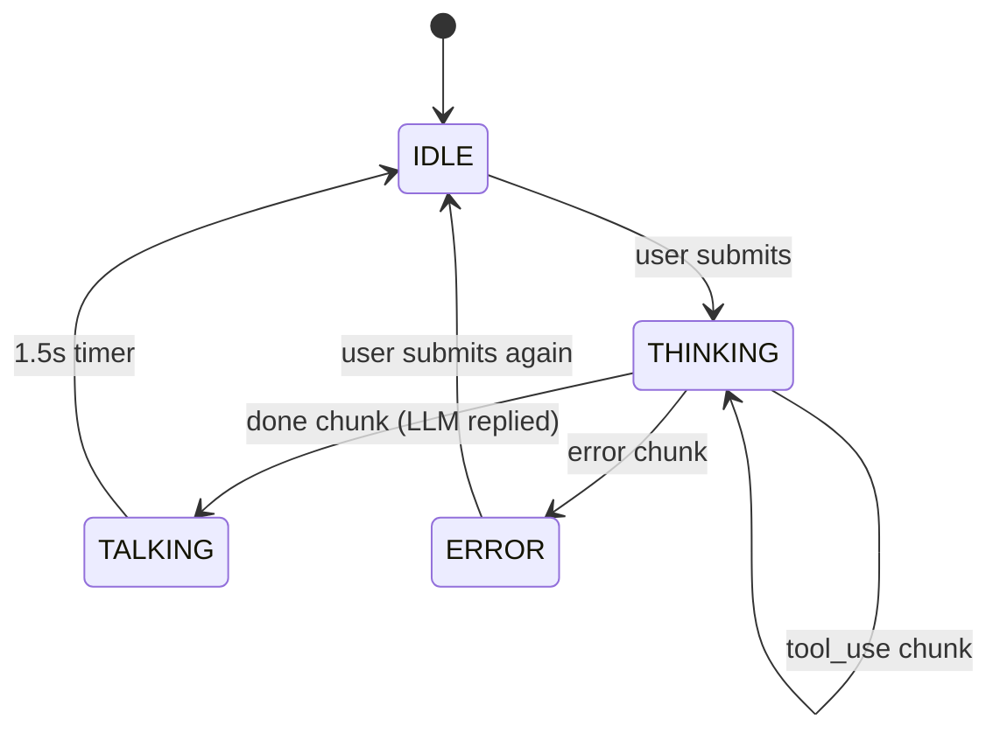

# Architecture — AgentBK-01

## System Overview

```mermaid
graph TB
    subgraph Desktop["Desktop App (macOS/PC)"]
        subgraph UI["UI Layer"]
            AV["Bot Face Avatar\n(procedural pixel draw)"]
            CP["Chat Scene\n(messages + streaming)"]
            ST["Settings Scene\n(provider, MCP, danger zone)"]
            MS["Main Scene\n(avatar card + nav buttons)"]
        end

        subgraph Core["Agent Core"]
            RT["AgentRouter\n(thread + queue)"]
            MEM["ConversationMemory\n(~/.agentbk/history.json)"]
            TL["ToolRegistry\n(get_datetime, calculate, weather)"]
            MCP["MCPClient × N\n(~/.agentbk/mcp_servers.json)"]
            RAG["RAGStore\n(ChromaDB ~/.agentbk/rag/)"]
        end

        subgraph Icons["Icon System"]
            IM["icon_manager.py\n(SVG → Pillow → pygame)"]
            SVG["app/assets/icons/*.svg\n(Heroicons MIT)"]
        end

        subgraph macOS["macOS Integration"]
            MB["menubar.py\n(NSStatusItem)"]
        end
    end

    subgraph TTS["TTS"]
        SP["TTSSpeaker\n(worker thread)"]
    end

    subgraph Providers["LLM Providers"]
        OLL["OllamaProvider\n(openai SDK, local)"]
        ANT["AnthropicProvider\n(anthropic SDK)"]
        OAI["OpenAIProvider\n(openai SDK)"]
    end

    CP -->|user text| RT
    RT -->|memory.add + thread| MEM
    RT -->|stream_tools() or stream()| OLL
    RT -->|stream_tools() or stream()| ANT
    RT -->|stream_tools() or stream()| OAI
    RT -->|_Chunk queue| CP
    TL -->|execute_tool()| RT
    MCP -->|tools list + call_tool()| RT
    RAG -->|search() hits| RT
    RT -->|speak(text)| SP
    AV <-->|state shared ref| MS
    AV <-->|state shared ref| CP
    IM --> SVG
    MB -->|avatar.draw() render| AV
```

---

## Component Architecture (as-built)



---

## Data Flow — ส่งข้อความ 1 ครั้ง

```mermaid
sequenceDiagram
    actor User
    participant Chat as ChatScene
    participant Router as AgentRouter
    participant Memory as ConversationMemory
    participant Provider as LLMProvider
    participant Tools as ToolRegistry
    participant TTS as TTSSpeaker
    participant Avatar as AvatarRenderer

    User->>Chat: พิมพ์ข้อความ + Enter
    Chat->>Router: start_stream(text)
    Router->>Memory: add("user", text)
    Router-->>Avatar: state = THINKING (via Chat)

    Note over Router: background thread + asyncio.run()

    Note over Router: RAG search → inject context into system prompt

    alt _wants_tools(text) == False  [fast path ~0.4s TTFT]
        Router->>Provider: stream(messages)
        loop each token
            Provider-->>Router: token str
            Router->>Chat: _Chunk(kind="chunk")
        end
        Router->>Chat: _Chunk(kind="done")

    else tool keywords detected  [tool path ~1.5s TTFT]
        loop round in range(MAX_TOOL_ROUNDS=5)
            Router->>Provider: stream_tools(messages, TOOL_SCHEMAS)
            alt yields list[ToolCallRequest]
                Router->>Chat: _Chunk(kind="tool_use")
                Router->>Tools: execute_tool(name, args)
                Tools-->>Router: result string
                Router->>Router: append tool messages
            else yields str tokens only
                loop each token
                    Provider-->>Router: token str
                    Router->>Chat: _Chunk(kind="chunk")
                end
                Router->>Chat: _Chunk(kind="done")
                break
            end
        end
    end

    Router->>Memory: add("assistant", full)
    Router->>Memory: persist()
    Chat->>TTS: speaker.speak(reply)
    Chat-->>Avatar: state = TALKING → IDLE
```

---

## Thread Model

```mermaid
graph LR
    subgraph Main["Main Thread (60fps)"]
        PGE["pygame event loop"]
        UPD["scenes.update()"]
        DRW["scenes.draw()"]
        DRN["router.drain()"]
    end

    subgraph BG["Background Threads"]
        WU["Warmup Thread\n(startup, daemon)"]
        MC["MCP Connect Thread × N\n(startup, daemon)"]
        TH["Stream Thread\n(per request, daemon)"]
        AR["asyncio.run(_async_stream)"]
        FP["Fast path: stream()"]
        TP["Tool path: stream_tools() loop"]
        TTS["TTS Worker Thread\n(daemon)"]
    end

    subgraph Q["Thread-safe Queue"]
        SQ["queue.SimpleQueue[_Chunk]"]
    end

    UPD --> DRN
    DRN --> SQ
    PGE --> UPD --> DRW
    WU -->|pre-warms KV cache| AR
    MC -->|MCPClient.connect()| AR
    TH --> AR
    AR --> FP
    AR --> TP
    FP -->|put chunk| SQ
    TP -->|put chunk| SQ
```

> `queue.SimpleQueue` ใช้แทน `pygame.event.post()` เพราะ pygame-ce 2.5+ ไม่น่าเชื่อถือเมื่อ post จาก background thread

> **Warmup thread** ส่ง request เล็กๆ ตอน init เพื่อ pre-fill Ollama KV cache ด้วย system prompt → TTFT ของ message แรกจะลดลงจาก ~2.1s → ~0.4s

---

## Avatar State Machine



---

## File Structure (as-built)

```
agentbk-01/
├── app/
│   ├── main.py                 entry point, SDL2 window, drag/resize
│   ├── avatar/
│   │   └── renderer.py         AvatarRenderer — procedural bot face
│   ├── ui/
│   │   ├── font_manager.py     Thai font loader
│   │   ├── button.py           Button widget (icon_surf support)
│   │   ├── icon_manager.py     SVG → Pillow → pygame Surface
│   │   ├── scene_manager.py    push/pop scene stack
│   │   ├── main_scene.py       avatar card + [Chat][Voice][Settings]
│   │   ├── chat_scene.py       streaming chat + tool indicator
│   │   └── settings_scene.py   provider, MCP list, KB, danger zone
│   ├── agent/
│   │   ├── router.py           AgentRouter (memory + tool loop + MCP + RAG)
│   │   ├── memory.py           ConversationMemory (persistent JSON)
│   │   ├── tools.py            built-in tools + TOOL_SCHEMAS
│   │   ├── mcp_config.py       load/save ~/.agentbk/mcp_servers.json
│   │   └── mcp_client.py       MCPClient (async SSE, tool dispatch)
│   ├── rag/
│   │   ├── __init__.py
│   │   ├── embedder.py         sentence-transformers (multilingual MiniLM)
│   │   ├── chunker.py          500-char chunks, 50-char overlap
│   │   ├── store.py            RAGStore — ChromaDB PersistentClient
│   │   └── ingestor.py         PDF / TXT / MD → chunk → embed → store
│   ├── providers/
│   │   ├── base.py                  BaseLLMProvider (stream + stream_tools + complete)
│   │   ├── ollama_provider.py       OllamaProvider via openai SDK
│   │   ├── anthropic_provider.py    AnthropicProvider via anthropic SDK
│   │   └── openai_provider.py       OpenAIProvider via openai SDK
│   ├── tts/
│   │   └── speaker.py          TTSSpeaker (edge-tts > macOS say > silent)
│   ├── tray/
│   │   └── menubar.py          macOS NSStatusItem + bot face icon
│   └── assets/
│       ├── fonts/              Thai font files
│       └── icons/              Heroicons SVG files
├── docs/                       this directory
├── pyproject.toml
└── .env
```
