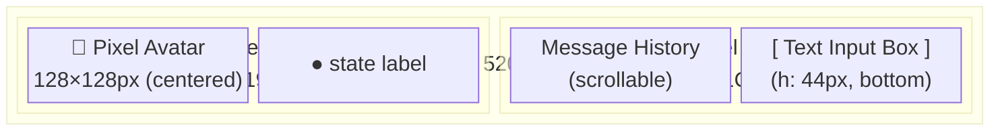
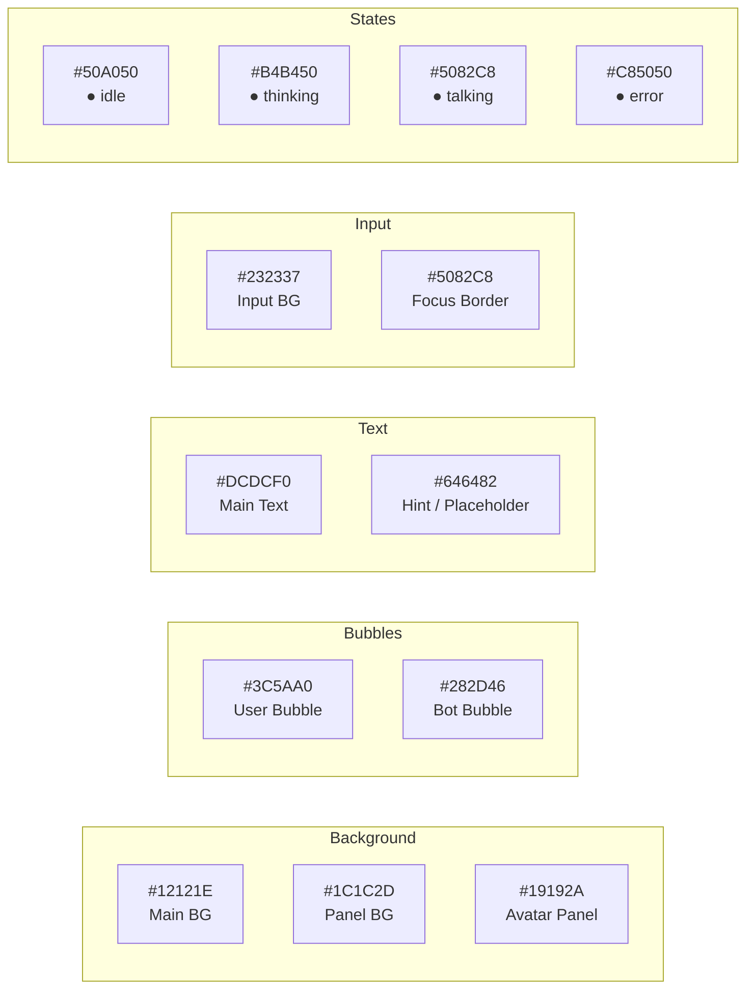
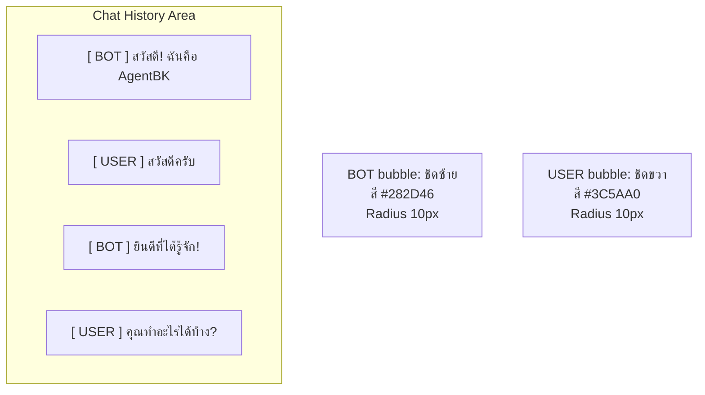
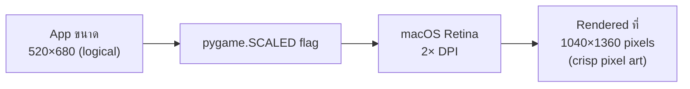

# UI Design — AgentBK-01

## Window Layout



---

## Color System



---

## UI States

```mermaid
stateDiagram-v2
    direction LR

    state "Idle" as S1 {
        note: Avatar bob ขึ้นลง\nกะพริบตา\nInput ใช้ได้
    }
    state "Thinking" as S2 {
        note: 3 จุดวิ่งเหนือหัว\nInput disabled\nChat แสดง "..."
    }
    state "Talking" as S3 {
        note: ปากเปิด-ปิด\nToken stream ไหลเข้า chat\nInput disabled
    }
    state "Error" as S4 {
        note: Avatar สีแดง\nแสดง error message\nInput ใช้ได้อีกครั้ง
    }

    [*] --> S1
    S1 --> S2 : ส่งข้อความ
    S2 --> S3 : ได้รับ token แรก
    S3 --> S1 : LLM จบ
    S2 --> S4 : API error
    S3 --> S4 : Stream error
    S4 --> S1 : ส่งข้อความใหม่
```

---

## Chat Bubble Layout



---

## Input Box Behavior

```mermaid
flowchart LR
    A([User Focus]) --> B[แสดง border สีฟ้า\n#5082C8]
    B --> C{มีข้อความ?}
    C -->|ไม่มี| D[แสดง placeholder\nสีเทา hint]
    C -->|มี| E[แสดงข้อความ + cursor |]
    E --> F{กด Enter?}
    F -->|ใช่, ไม่ว่าง| G[emit SUBMIT_EVENT\nclear input]
    F -->|Backspace| H[ลบตัวอักษรสุดท้าย]
    F -->|ตัวอักษร| I[append to buffer]
```

---

## Responsive Scaling (macOS Retina)



---

## Typography

| ใช้งาน | Font | Size | Weight |
|--------|------|------|--------|
| ข้อความใน chat | `monospace` | 14px | regular |
| ชื่อผู้ส่ง | `monospace` | 14px | bold |
| placeholder input | `monospace` | 13px | regular |
| state label | `monospace` | 11px | regular |
