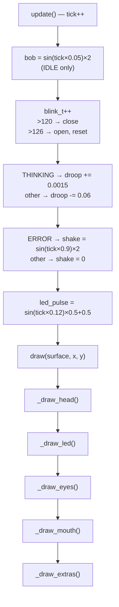
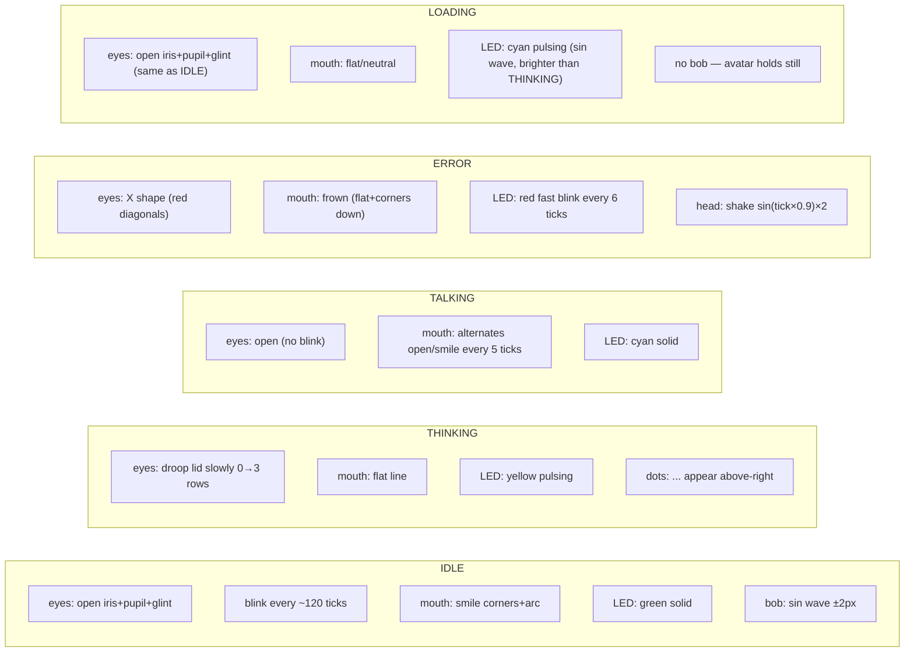
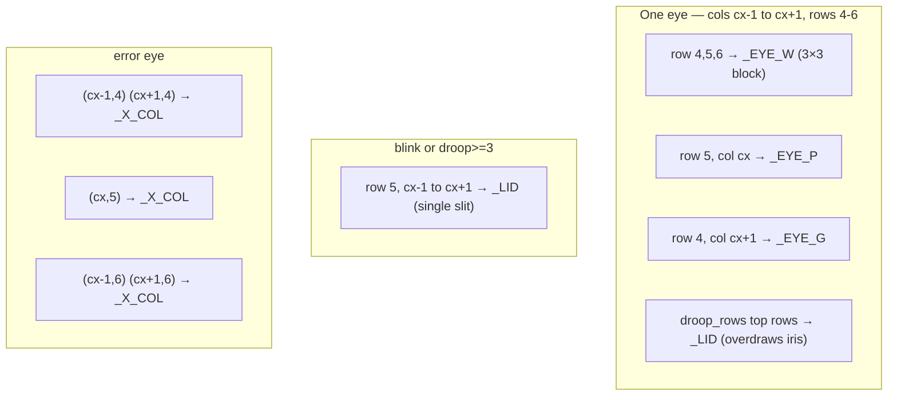

# Avatar System — AgentBK-01

## Overview

Avatar เป็น **procedural bot face** วาดด้วย `pygame.draw.rect()` บน grid 16×16 units
โดยแต่ละ unit = `PIXEL = 8` screen pixels → canvas 128×128 px

ไม่ใช้ sprite sheet ภายนอก ทุก expression สร้างจาก code ล้วน

---

## Visual Design

```
col:  0 1 2 3 4 5 6 7 8 9 10 11 12 13 14 15
row:
 0              [LED][LED]                     ← antenna LED (2px)
 1        [====head top highlight====]
 2        [====head body=============]
 3        [====face screen============]
 4        [    [eye L ]   [eye R ]    ]
 5        [    [pupil]    [pupil ]    ]
 6        [    [glint]    [glint ]    ]        ← droopy lid covers 4-6
 7        [                           ]
 8        [  [smile corner]  [corner] ]
 9        [      [smile arc——————]   ]
10        [                           ]
11        [====face screen bottom=====]
12        [====head bottom============]

cheek tint at cols 3,12 row 8
```

---

## Color Palette

| Constant | RGB | ใช้สำหรับ |
|----------|-----|----------|
| `_HEAD` | (42,45,78) | head body |
| `_HEAD_L` | (60,64,108) | top edge highlight |
| `_SCREEN` | (22,24,45) | face screen interior |
| `_EYE_W` | (185,205,250) | iris / eye white |
| `_EYE_P` | (55,95,215) | pupil |
| `_EYE_G` | (230,235,255) | pupil glint |
| `_LID` | (38,40,70) | eyelid (droopy) |
| `_SMILE` | (120,175,255) | smile / mouth lines |
| `_MOUTH_D` | (12,14,30) | open-mouth cavity |
| `_TEETH` | (200,220,255) | teeth row |
| `_X_COL` | (210,70,70) | X-eye (error) |
| `_ZZZ` | (130,140,195) | thinking dots |
| `_CHEEK` | (55,50,100) | cheek tint |
| `_LED_I` | (80,220,120) | idle LED (green) |
| `_LED_TH` | (255,200,50) | thinking LED (yellow) |
| `_LED_TK` | (80,200,255) | talking LED (cyan) |
| `_LED_E` | (220,60,60) | error LED (red) |
| `_LED_L` | (80+v//2, 140+v//2, 255) | loading LED (pulsing cyan) |

---

## Rendering Pipeline



---

## Expression per State



---

## Eye Detail



---

## LED Behaviour

| State | Colour | Pattern |
|-------|--------|---------|
| IDLE | `_LED_I` green | solid |
| THINKING | yellow pulse | `led_pulse` sin interpolation |
| TALKING | `_LED_TK` cyan | solid |
| ERROR | `_LED_E` red | blink every 6 ticks (on/head color) |
| LOADING | `(80+v//2, 140+v//2, 255)` cyan | pulsing (sin wave, `v` = 0-127) |

---

## Animation Timings (at 60fps)

| Animation | Period |
|-----------|--------|
| Bob wave | ~125 ticks (~2.1s full cycle) |
| Blink interval | 120 ticks (~2s), close 6 ticks |
| Droop rise (THINKING) | +0.0015/tick → full in ~667 ticks (~11s) |
| Droop fall | -0.06/tick → full reset in ~17 ticks |
| Talking mouth | toggle every 5 ticks (~12 flaps/s) |
| Error shake | sin(tick×0.9) ×2 px |
| LED pulse | sin(tick×0.12) → ~52-tick half-cycle |
| Thinking dots | (tick//25)%4 → new dot every 25 ticks |

---

## Mini Avatar (Chat Header & Menubar)

`AvatarRenderer.draw()` renders to a full 128×128 surface, then `pygame.transform.smoothscale()` scales it down:

| Context | Size | Method |
|---------|------|--------|
| Chat header | 48×48 | `smoothscale` |
| Main scene card | proportional to card | `smoothscale` |
| macOS menubar | 32×32 → displayed 16pt | Pillow → NSImage |

---

## Adding a New State

1. Add value to `AvatarState` enum in `renderer.py`
2. Handle in `update()` — droop/shake/blink logic
3. Handle in `_draw_eyes()`, `_draw_mouth()`, `_draw_led()`, `_draw_extras()`
4. Add entry to `_STATE_INFO` dict in `main_scene.py` (label + colour)
