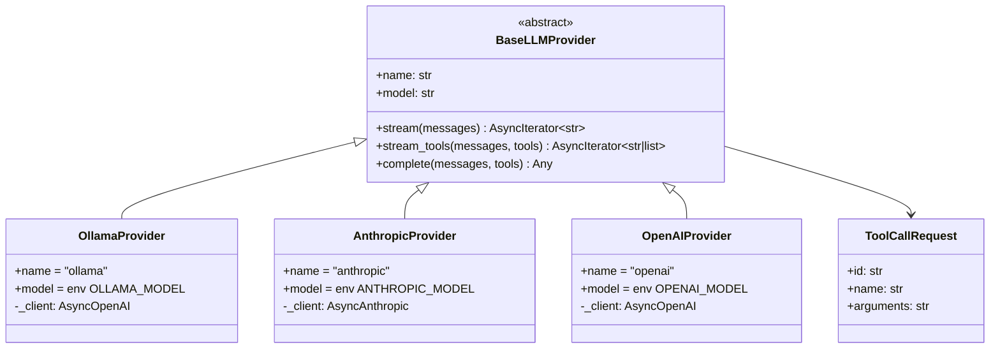
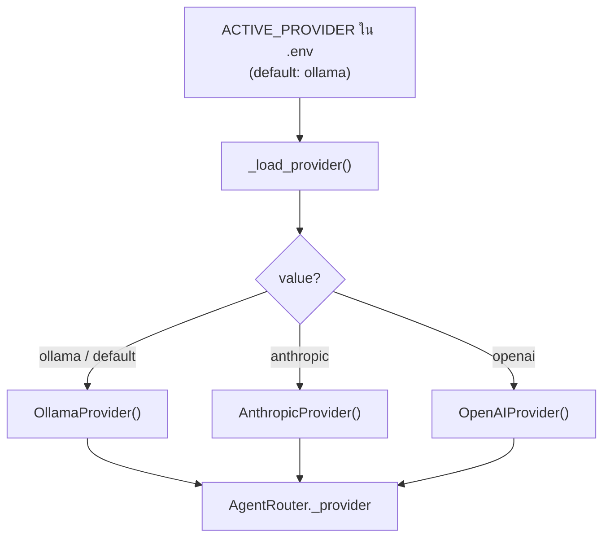
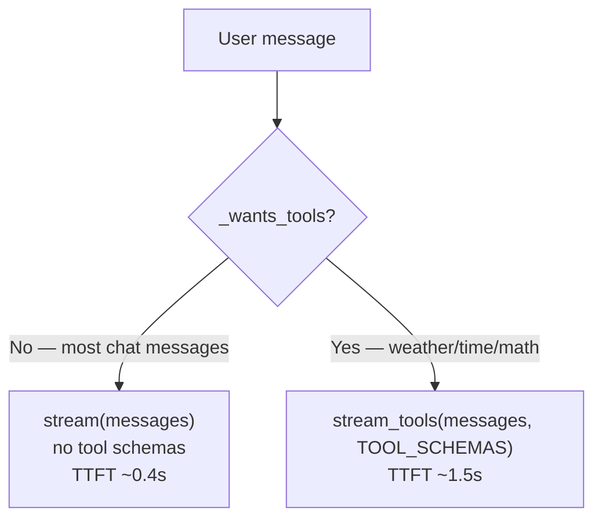

# LLM Providers — AgentBK-01

## Provider Pattern

ทุก provider implement `BaseLLMProvider` เดียวกัน
ทำให้ `AgentRouter` ไม่รู้ว่ากำลังคุยกับ API ไหน



---

## Provider Interface

```python
from app.providers.base import BaseLLMProvider, ToolCallRequest

class BaseLLMProvider(ABC):
    name: str
    model: str

    @abstractmethod
    async def stream(self, messages: list[dict]) -> AsyncIterator[str]:
        """Fast path — plain token streaming, no tool schemas."""
        ...

    @abstractmethod
    async def stream_tools(
        self,
        messages: list[dict],
        tools: list[dict],
    ) -> AsyncIterator[str | list[ToolCallRequest]]:
        """Single-pass streaming with tool-call support.

        Yields:
        - str                  — text token (same as stream())
        - list[ToolCallRequest] — tool calls requested (one batch, at end)

        If the model decides to call tools, the generator ends by yielding
        a list[ToolCallRequest] instead of the normal done sentinel.
        """
        ...

    @abstractmethod
    async def complete(
        self,
        messages: list[dict],
        tools: list[dict] | None = None,
    ) -> Any:
        """Non-streaming call. Returns raw SDK response object."""
        ...
```

> `stream_tools()` เป็น method หลักที่ router ใช้เมื่อ message มีคำที่เกี่ยวกับ tools
> ผล yield จะเป็น `str` (token) หรือ `list[ToolCallRequest]` (ถ้า model เรียก tool)

---

## Provider Selection Flow



---

## Ollama Provider

ใช้ openai Python SDK กับ Ollama's OpenAI-compatible endpoint:

```python
self._client = AsyncOpenAI(
    base_url="http://localhost:11434/v1",
    api_key="ollama",   # required by SDK, ignored by Ollama
)
```

### stream_tools() — single-pass tool accumulation

```python
async def stream_tools(self, messages, tools):
    response = await self._client.chat.completions.create(
        model=self.model, messages=messages, tools=tools, stream=True
    )
    tool_calls_acc: dict[int, dict] = {}   # index → {id, name, arguments}
    async for chunk in response:
        delta = chunk.choices[0].delta
        if delta.content:
            yield delta.content            # text token
        if delta.tool_calls:
            for tc_delta in delta.tool_calls:
                # accumulate streaming tool-call deltas
                ...
        if chunk.choices[0].finish_reason == "tool_calls":
            yield [ToolCallRequest(...) for v in tool_calls_acc.values()]
            return
```

---

## Anthropic Provider

แปลง message format OpenAI → Anthropic และ response กลับเป็น OpenAI shape

### Format Conversion

```mermaid
flowchart LR
    OAI_MSG["OpenAI messages\n[{role, content}, ...]"]
    ANT_MSG["Anthropic messages\n(no system role,\ntool_result merging)"]
    OAI_TOOLS["OpenAI tool schemas\n[{type, function: {name,...}}]"]
    ANT_TOOLS["Anthropic tools\n[{name, description, input_schema}]"]

    OAI_MSG -->|_convert_messages()| ANT_MSG
    OAI_TOOLS -->|_convert_tools()| ANT_TOOLS
```

### stream_tools() — Anthropic SSE events

```python
async def stream_tools(self, messages, tools):
    async with self._client.messages.stream(
        ..., tools=_convert_tools(tools)
    ) as stream:
        async for event in stream:
            if event.type == "content_block_delta":
                if event.delta.type == "text_delta":
                    yield event.delta.text
                elif event.delta.type == "input_json_delta":
                    tool_calls_acc[current_id]["arguments"] += event.delta.partial_json
            elif event.type == "message_delta":
                if event.delta.stop_reason == "tool_use":
                    yield [ToolCallRequest(...) for each accumulated call]
                    return
```

### Consecutive user-turn merging

Anthropic ไม่รับ 2 consecutive user turns — `_convert_messages()` จะ merge
`tool_result` messages ที่ติดกันเข้าเป็น list ใน turn เดียว:

```
[user: text] [assistant: tool_use] [tool: result1] [tool: result2]
                                    ↓ _convert_messages()
[user: text] [assistant: [{tool_use},...]] [user: [{tool_result1},{tool_result2}]]
```

---

## OpenAI Provider

เหมือน `OllamaProvider` แต่ไม่ override `base_url`:

```python
self._client = AsyncOpenAI(api_key=os.getenv("OPENAI_API_KEY", ""))
```

`stream_tools()` ใช้ logic เดียวกับ Ollama เพราะ OpenAI API format เหมือนกัน

---

## Performance — TTFT (Time to First Token)

### ปัญหาเดิม (2-phase approach)

```
Phase A: complete(messages, tools=TOOL_SCHEMAS)  → ~3.2s (blocking, non-streaming)
Phase B: stream(messages)                        → ~1.6s to first token
Total: ~5s before first character appears
```

### การแก้ไข



**Keyword triggers** (`_TOOL_WORDS`):
- time/date: `time`, `date`, `today`, `now`, `เวลา`, `วันที่`, `วันนี้`, `ตอนนี้`
- math: `calculate`, `compute`, `math`, `คำนวณ`, `บวก`, `ลบ`, `คูณ`, `หาร`
- weather: `weather`, `forecast`, `อากาศ`, `พยากรณ์`, `ฝน`, `ร้อน`, `หนาว`

### KV Cache Warmup

`AgentRouter.__init__()` spawns a background thread ที่ส่ง dummy request ทันที
เพื่อ pre-fill Ollama's KV cache ด้วย system prompt:

```python
def _warmup(self) -> None:
    async def _do():
        warmup_msgs = [
            {"role": "system", "content": _SYSTEM_PROMPT},
            {"role": "user",   "content": "hi"},
        ]
        async for _ in self._provider.stream(warmup_msgs):
            break  # one token is enough
    asyncio.run(_do())
```

| สถานการณ์ | TTFT |
|-----------|------|
| cold start (ไม่มี warmup) | ~2.1s |
| หลัง warmup (fast path) | **~0.4s** |
| tool path หลัง warmup | **~1.5s** |
| เดิม (2-phase complete + stream) | ~5.0s |

---

## Tool-calling Model Compatibility

| Model | Tool calling |
|-------|-------------|
| `qwen2.5-coder:7b` | ✅ |
| `llama3.1` | ✅ |
| `mistral-nemo` | ✅ |
| `llama3` (base) | ❌ |
| `phi3` | บางตัว |

ถ้า model ไม่ support tools จะ return text ปกติ — `stream_tools()` จะ yield text tokens เฉยๆ โดยไม่มี `list[ToolCallRequest]` → graceful degradation

---

## Environment Variables

```bash
ACTIVE_PROVIDER=ollama          # ollama | anthropic | openai
OLLAMA_BASE_URL=http://localhost:11434
OLLAMA_MODEL=qwen2.5-coder:7b

ANTHROPIC_API_KEY=sk-ant-...
ANTHROPIC_MODEL=claude-sonnet-4-6   # optional, default: claude-sonnet-4-6

OPENAI_API_KEY=sk-...
OPENAI_MODEL=gpt-4o-mini            # optional, default: gpt-4o-mini
```

---

## Adding a New Provider

```python
# app/providers/myprovider.py
from app.providers.base import BaseLLMProvider, ToolCallRequest
from typing import Any, AsyncIterator

class MyProvider(BaseLLMProvider):
    name = "myprovider"

    def __init__(self) -> None:
        self.model = "my-model-v1"

    async def stream(self, messages: list[dict]) -> AsyncIterator[str]:
        # fast path — no tools
        ...
        yield token

    async def stream_tools(
        self,
        messages: list[dict],
        tools: list[dict],
    ) -> AsyncIterator[str | list[ToolCallRequest]]:
        # yield text tokens; if model calls tools, yield list[ToolCallRequest] at end
        ...
        yield token
        # OR: yield [ToolCallRequest(id=..., name=..., arguments=...)]

    async def complete(
        self, messages: list[dict], tools: list[dict] | None = None
    ) -> Any:
        ...
        return response
```

เพิ่ม branch ใน `_load_provider()` ใน `router.py`:
```python
if name == "myprovider":
    from app.providers.myprovider import MyProvider
    return MyProvider()
```
