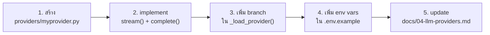

# Developer Guide — AgentBK-01

## Prerequisites

- Python 3.11+
- [uv](https://docs.astral.sh/uv/) package manager
- [Ollama](https://ollama.ai) (local LLM, default provider)
- macOS (สำหรับ menubar integration — optional บน Windows/Linux)

---

## Setup

```bash
# 1. install uv (ถ้ายังไม่มี)
curl -LsSf https://astral.sh/uv/install.sh | sh

# 2. install dependencies
cd agentbk-01
uv sync

# 3. ตั้งค่า env
cp .env.example .env
# แก้ไข .env (ตั้ง ACTIVE_PROVIDER=ollama ไว้เลยถ้าใช้ Ollama)

# 4. run
uv run python -m app.main
# AgentBK จะ auto-start Ollama และ pull model ให้อัตโนมัติ (ครั้งแรก ~2-5 นาที)
```

---

## Environment Variables

| Variable | Default | คำอธิบาย |
|----------|---------|----------|
| `ACTIVE_PROVIDER` | `ollama` | provider ที่ใช้: `ollama` / `anthropic` / `openai` |
| `OLLAMA_BASE_URL` | `http://localhost:11434` | Ollama endpoint |
| `OLLAMA_MODEL` | `qwen2.5:3b` | model ที่ใช้ (ต้อง support tool calling) |
| `ANTHROPIC_API_KEY` | — | สำหรับ Phase 4 |
| `OPENAI_API_KEY` | — | สำหรับ Phase 4 |
| `MCP_ENABLED` | `false` | เปิด/ปิด MCP Server |
| `MCP_SERVER_URL` | `http://localhost:8000/mcp` | MCP endpoint |

---

## Project Structure

```
agentbk-01/
├── app/
│   ├── main.py                 entry point — window, drag, resize, scene loop
│   │
│   ├── avatar/
│   │   └── renderer.py         AvatarRenderer (procedural bot face)
│   │
│   ├── ui/
│   │   ├── font_manager.py     Thai font (SukhumvitSet → Ayuthaya → fallback)
│   │   ├── button.py           Button widget (text + icon_surf)
│   │   ├── icon_manager.py     SVG → Pillow → pygame Surface (lru_cache)
│   │   ├── scene_manager.py    SceneManager push/pop stack
│   │   ├── main_scene.py       avatar card + [Chat][Voice][Settings]
│   │   ├── chat_scene.py       streaming bubbles + tool indicator
│   │   └── settings_scene.py   provider, MCP config, Danger Zone
│   │
│   ├── agent/
│   │   ├── router.py           AgentRouter (memory + tool loop + queue)
│   │   ├── memory.py           ConversationMemory (~/.agentbk/history.json)
    │   ├── tools.py            TOOL_SCHEMAS + execute_tool()
    │   ├── ollama_manager.py   OllamaManager (auto-start Ollama + pull model)
    │   └── mcp_client.py       MCPClient (streamable-http transport)
│   │
│   ├── providers/
│   │   ├── base.py             BaseLLMProvider (stream + complete)
│   │   └── ollama_provider.py  OllamaProvider via openai SDK
│   │
│   ├── tray/
│   │   └── menubar.py          macOS NSStatusItem + bot face icon
│   │
│   └── assets/
│       ├── fonts/              Thai font files (.ttf)
│       └── icons/              Heroicons SVG (MIT license)
│
├── docs/                       documentation (this directory)
├── tests/                      test files
├── pyproject.toml
├── .env
└── CLAUDE.md
```

---

## Coding Conventions

### Async pattern — ไม่บล็อก pygame loop

```python
# ✅ ถูก — provider ใช้ async/await
async def stream(self, messages: list[dict]) -> AsyncIterator[str]:
    async for chunk in self._client.chat.completions.create(..., stream=True):
        yield chunk.choices[0].delta.content or ""

# ❌ ผิด — blocking call จะทำให้ pygame หยุด
def stream(self, messages):
    response = requests.post(...)  # blocks event loop
```

### Thread → main thread communication

```python
# ✅ ถูก — SimpleQueue (thread-safe, polled at 60fps)
self.result_queue.put(_Chunk(kind="chunk", text=token))

# ❌ ผิด — pygame.event.post() ไม่น่าเชื่อถือจาก background thread
pygame.event.post(pygame.event.Event(AGENT_CHUNK, text=token))
```

### Dynamic layout — ไม่ hardcode ขนาด

```python
# ✅ ถูก — คำนวณ Rect จาก surface.get_size()
def draw(self, surface: pygame.Surface) -> None:
    w, h = surface.get_size()
    if (w, h) != self._last_size:
        self._layout(w, h)

# ❌ ผิด — hardcode ค่าคงที่
pygame.draw.rect(surface, color, (0, 0, 360, 520))
```

### Font — ใช้ font_manager เสมอ

```python
# ✅ ถูก — Thai font ออก
font = font_manager.get(14)

# ❌ ผิด — Thai ไม่ออก
font = pygame.font.SysFont("Arial", 14)
```

### Security — safe eval สำหรับ tools

```python
# ✅ ถูก — AST whitelist
tree = ast.parse(expr, mode="eval")
for node in ast.walk(tree):
    if type(node) not in _SAFE_NODES:
        return "Error: disallowed"

# ❌ ผิด — arbitrary code execution
result = eval(expr)
```

---

## Adding a New LLM Provider



---

## Adding a New Tool

1. เพิ่ม schema ใน `TOOL_SCHEMAS` ใน `app/agent/tools.py`
2. เพิ่ม branch ใน `execute_tool(name, arguments)`
3. เขียน implementation function
4. update `docs/06-agent-tools.md`

ดูรายละเอียดใน [06-agent-tools.md](./06-agent-tools.md)

---

## Adding a New Scene

```python
# app/ui/my_scene.py
from app.ui.scene_manager import BaseScene

class MyScene(BaseScene):
    def __init__(self, win_w: int, win_h: int) -> None:
        self._last_size = (-1, -1)
        self._layout(win_w, win_h)

    def _layout(self, w: int, h: int) -> None:
        self._last_size = (w, h)
        # คำนวณ Rect ทุกตัวที่นี่

    def handle_event(self, event: pygame.event.Event) -> None: ...
    def update(self) -> None: ...

    def draw(self, surface: pygame.Surface) -> None:
        w, h = surface.get_size()
        if (w, h) != self._last_size:
            self._layout(w, h)
        # render
```

---

## Common Issues

| ปัญหา | สาเหตุ | วิธีแก้ |
|-------|--------|---------|
| `pygame.error: No video mode` | ไม่มี display (SSH) | รันใน GUI session |
| `ModuleNotFoundError` | ยังไม่ได้ `uv sync` | รัน `uv sync` |
| Bot ไม่ตอบ | Ollama ไม่ได้รัน | รัน `ollama serve` |
| Tool calling ไม่ทำงาน | Model ไม่ support tools | เปลี่ยนเป็น `qwen2.5-coder:7b` |
| Thai ไม่ออก | ใช้ `SysFont` โดยตรง | ใช้ `font_manager.get()` |
| Icon เป็น □ | SVG parse error | เช็ค `app/assets/icons/*.svg` ว่าโหลดได้ |
| History ไม่ save | Permission denied | ตรวจสอบ `~/.agentbk/` directory |

---

## Testing

```bash
# syntax check ทั้งโปรเจกต์
uv run python -m py_compile app/agent/router.py
uv run python -m py_compile app/agent/memory.py
uv run python -m py_compile app/agent/tools.py

# test tools ด้วยตรง
uv run python -c "
from app.agent.tools import execute_tool
print(execute_tool('get_datetime', {}))
print(execute_tool('calculate', {'expression': '(2+3)*4'}))
print(execute_tool('get_weather', {'city': 'Bangkok'}))
"

# run app
uv run python -m app.main
```
