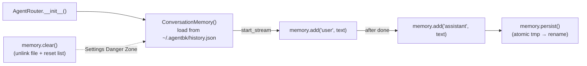
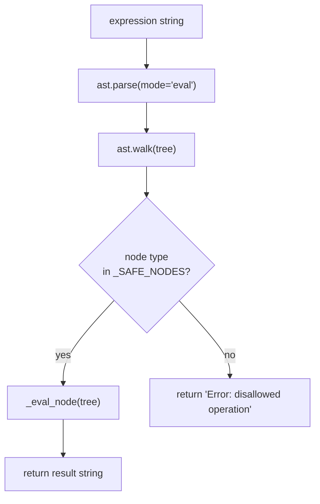
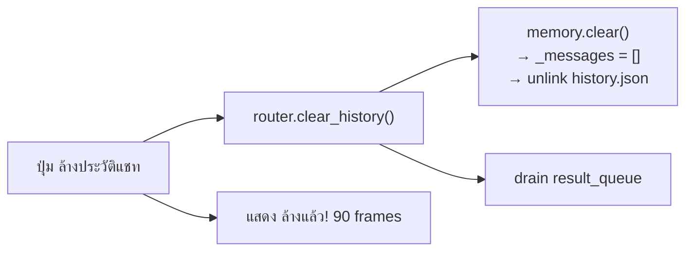

# Agent Tools & Memory — AgentBK-01

## Conversation Memory

### Overview

`ConversationMemory` เก็บ history แบบ persistent ใน `~/.agentbk/history.json`
ทุก session ใหม่จะโหลด history เดิมขึ้นมา — bot จำบทสนทนาข้ามการเปิด app ได้



### Rolling Window

- เก็บสูงสุด **100 messages** (`_MAX_MESSAGES`)
- เมื่อเกิน 100 จะตัด messages เก่าสุดออก (sliding window)
- ป้องกัน context window ใหญ่เกิน + disk โตไม่หยุด

### Atomic Write

```python
def persist(self) -> None:
    tmp = self._path.with_suffix(".tmp")
    with tmp.open("w") as f:
        json.dump(self._messages, f, ensure_ascii=False, indent=2)
    tmp.replace(self._path)   # atomic rename — ไม่มี partial write
```

### File Location

```
~/.agentbk/
└── history.json    ← conversation history
    history.tmp     ← temp file ระหว่าง write (ลบเองอัตโนมัติ)
```

---

## Built-in Tools

### Tool Schema Format (OpenAI function-calling)

```python
TOOL_SCHEMAS: list[dict] = [
    {
        "type": "function",
        "function": {
            "name": "tool_name",
            "description": "...",
            "parameters": {
                "type": "object",
                "properties": { ... },
                "required": [ ... ],
            },
        },
    },
    ...
]
```

---

### get_datetime

**Description:** วันเวลาปัจจุบัน timezone Asia/Bangkok (UTC+7)

**Parameters:** ไม่มี

**Example output:**
```
Saturday, 28 March 2026  23:15:42 (ICT / UTC+7)
```

**Use case:** ผู้ใช้ถาม "ตอนนี้กี่โมง" หรือ "วันนี้วันอะไร"

---

### calculate

**Description:** คำนวณ arithmetic expression แบบปลอดภัย

**Parameters:**
- `expression: string` — e.g. `"(2 + 3) * 4"`, `"2 ** 10"`, `"355 / 113"`

**Supported operators:** `+`, `-`, `*`, `/`, `//`, `%`, `**`, parentheses

**Security:** ใช้ AST whitelist — ไม่ใช้ `eval()` — reject ทุก node ที่ไม่ใช่ arithmetic



**Safe nodes whitelist:**
`Expression`, `BinOp`, `UnaryOp`, `Constant`,
`Add`, `Sub`, `Mult`, `Div`, `FloorDiv`, `Mod`, `Pow`, `UAdd`, `USub`

---

### get_weather

**Description:** ข้อมูลอากาศปัจจุบันสำหรับเมืองที่ระบุ ผ่าน wttr.in API

**Parameters:**
- `city: string` — ชื่อเมือง (ไทยหรืออังกฤษ)

**Implementation:** async HTTP ผ่าน `httpx` → `wttr.in/{city}?format=j1` (JSON)

**Example output:**
```
Bangkok: 32°C, Partly cloudy. Humidity 74%. Wind 18 km/h SSE. Feels like 38°C.
```

**Fallback:** ถ้า network error หรือ city ไม่พบ จะ return ข้อความ error ที่ LLM อ่านได้

---

## Tool Loop Architecture

Router ใช้ 2 เส้นทาง ขึ้นอยู่กับ message ของ user:

```mermaid
flowchart TD
    MSG["User message"]
    KW{_wants_tools?\nkeyword check}
    FAST["Fast path\nstream(messages)\nno tool schemas\nTTFT ~0.4s"]
    TOOL["Tool path\nstream_tools(messages, TOOL_SCHEMAS)\nTTFT ~1.5s"]
    DONE["_Chunk(kind='done')"]

    MSG --> KW
    KW -->|No| FAST --> DONE
    KW -->|Yes| TOOL
    TOOL -->|text tokens only| DONE
    TOOL -->|list[ToolCallRequest]| EXEC["execute_tool()"]
    EXEC -->|append tool result| TOOL
```

### Single-pass stream_tools() loop

```mermaid
sequenceDiagram
    participant Router as AgentRouter._async_stream
    participant LLM as Provider.stream_tools()
    participant Tools as execute_tool()
    participant Queue as result_queue

    loop round in range(MAX_TOOL_ROUNDS+1=6)
        Router->>LLM: stream_tools(messages, tools)

        alt yields str tokens
            loop each token
                LLM-->>Router: str token
                Router->>Queue: _Chunk(kind="chunk")
            end
            Router->>Queue: _Chunk(kind="done")
            break

        else yields list[ToolCallRequest]
            LLM-->>Router: [ToolCallRequest, ...]
            Router->>Router: messages.append(assistant + tool_calls)
            loop each tool
                Router->>Queue: _Chunk(kind="tool_use", text=name)
                Router->>Tools: execute_tool(name, args)
                Tools-->>Router: result string
                Router->>Router: messages.append(tool_result)
            end
        end
    end
```

### _Chunk kinds

| kind | เมื่อไหร่ | UI action |
|------|----------|----------|
| `chunk` | ทุก token จาก LLM | append ต่อ streaming bubble |
| `done` | LLM ส่งครบ | clear indicator, state → TALKING → IDLE |
| `error` | exception | แสดง error bubble, state → ERROR |
| `tool_use` | เรียก tool | แสดง pill indicator, state → THINKING |

---

## UI — Tool Indicator Pill

เมื่อได้รับ `_Chunk(kind="tool_use")` จะแสดง pill สีน้ำเงินที่ด้านล่างของ chat area:

```
┌──────────────────────────────────┐
│  (messages area)                 │
│                                  │
│  ┌─────────────────┐             │
│  │ tool: get_datetime│           │  ← indicator pill
│  └─────────────────┘             │
└──────────────────────────────────┘
│  [input box           ]    [→]   │
└──────────────────────────────────┘
```

Pill จะหายไปเมื่อ `done` หรือ `error` มาถึง

---

## Adding a New Tool

1. เพิ่ม schema ใน `TOOL_SCHEMAS` ใน `app/agent/tools.py`
2. เพิ่ม `elif name == "my_tool":` ใน `execute_tool()`
3. เขียน implementation function `_my_tool(args)`

```python
# 1. Schema
TOOL_SCHEMAS.append({
    "type": "function",
    "function": {
        "name": "my_tool",
        "description": "Does something useful.",
        "parameters": {
            "type": "object",
            "properties": {
                "input": {"type": "string", "description": "..."}
            },
            "required": ["input"],
        },
    },
})

# 2. Dispatch
def execute_tool(name, arguments):
    ...
    if name == "my_tool":
        return _my_tool(arguments.get("input", ""))

# 3. Implementation
def _my_tool(input: str) -> str:
    return f"Result for: {input}"
```

---

## Settings — Danger Zone

Settings scene มี card "Danger Zone" ที่ด้านล่างสุด:



> history ที่ลบแล้วไม่สามารถกู้คืนได้ — bot จะเริ่มบทสนทนาใหม่ทันที
