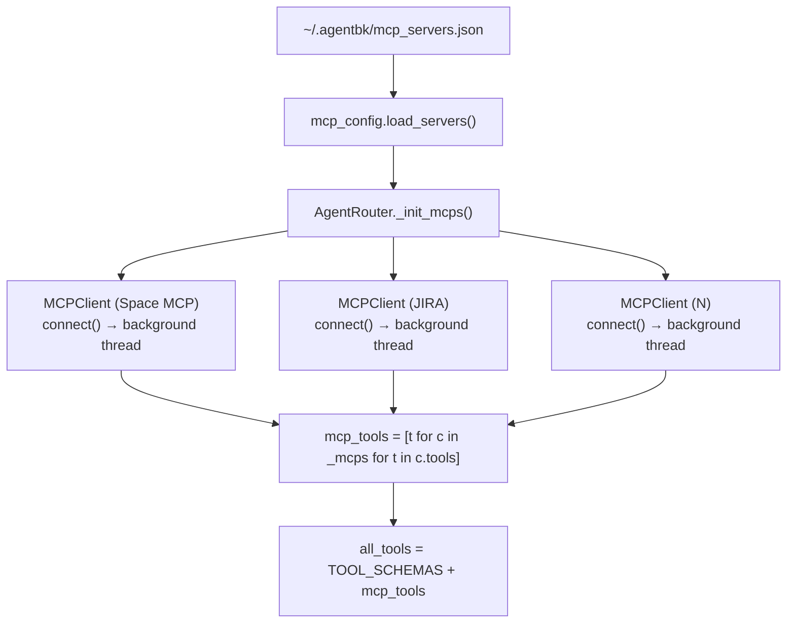
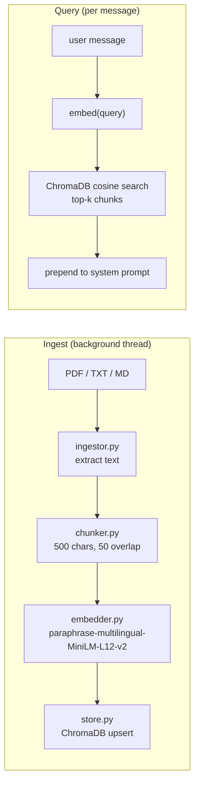

# Multi-MCP & RAG Knowledge Base — AgentBK-01

## Overview

Phase 6 เพิ่ม 2 ความสามารถหลัก:
1. **Multi-MCP** — รองรับ N MCP servers พร้อมกัน, config เป็น JSON file, จัดการได้ใน Settings
2. **RAG Knowledge Base** — อ่านเอกสาร PDF/TXT/MD, embed ด้วย sentence-transformers, เก็บใน ChromaDB, inject context ก่อน LLM call

---

## Feature 1: Multi-MCP Support

### Config File: `~/.agentbk/mcp_servers.json`

```json
[
  {
    "name": "Space MCP",
    "url": "http://localhost:8000/mcp",
    "enabled": true
  },
  {
    "name": "JIRA",
    "url": "https://jira.company.com/mcp",
    "headers": {
      "Authorization": "Bearer sk-xxx",
      "X-Team": "engineering"
    },
    "enabled": false
  },
  {
    "name": "Google Calendar",
    "url": "http://gcal.local/mcp",
    "enabled": false
  }
]
```

**Field reference:**

| Field | Type | Required | คำอธิบาย |
|-------|------|----------|----------|
| `name` | string | ✓ | ชื่อแสดงใน UI |
| `url` | string | ✓ | HTTP/HTTPS endpoint |
| `headers` | object | — | Custom HTTP headers (auth, API keys ฯลฯ) |
| `enabled` | boolean | — | เปิด/ปิด (default: false) |

> **Auth:** ไม่มี auth type พิเศษ — ใส่ header ตรงๆ ได้เลย เช่น `"Authorization": "Bearer <token>"` หรือ `"X-API-Key": "<key>"`
> Server ที่ไม่มี `headers` จะใช้ `{}` (ไม่มี header พิเศษ)

### Architecture



### Tool Dispatch

เมื่อ LLM เรียก tool — router หา MCPClient ที่ owns tool นั้น (first match):

```mermaid
flowchart LR
    TC["ToolCallRequest(name=X)"]
    LOOP["for client in _mcps"]
    OWN{client.owns(X)?}
    MCP["client.call_tool(X, args)"]
    LOCAL["execute_tool(X, args)"]
    RES["result string → messages"]

    TC --> LOOP --> OWN
    OWN -->|yes| MCP --> RES
    OWN -->|no, next| LOOP
    LOOP -->|none matched| LOCAL --> RES
```

### mcp_config.py API

| Function | คำอธิบาย |
|----------|----------|
| `load_servers() -> list[dict]` | อ่าน JSON file, return `[]` ถ้าไม่มีไฟล์ |
| `save_servers(servers)` | atomic write (tmp → rename) |
| `MCP_PRESETS` | list ของ preset ที่ใช้ใน Settings form |

### Settings UI — MCP Servers Card

```
┌─ MCP Servers ──────────────────────────────── [+] ─┐
│ ● Space MCP (local)  localhost:8000/mcp      [✎][✕] │
│ ○ JIRA               jira.company.com/mcp 🔑2 [✎][✕] │
│ ○ Google Calendar    gcal.local/mcp          [✎][✕] │
└──────────────────────────────────────────────────┘
```

- **●/○** — toggle enable/disable (บันทึกทันทีตอน Save)
- **🔑N** — badge แสดงจำนวน custom headers ที่ตั้งไว้
- **[✎]** — เปิด inline form แก้ไข name + URL + headers
- **[✕]** — ลบ server
- **[+]** — เปิด inline form เพิ่ม server ใหม่

Inline form (ปรากฏด้านล่าง list):
```
Presets: [Space MCP] [JIRA] [Google Cal]
ชื่อ:    [_________________________]
URL:     [_________________________]
Headers: [{"Authorization": "Bearer ..."}]
[บันทึก] [ยกเลิก]
```

> **Headers** รับ JSON object เช่น `{"Authorization": "Bearer sk-xxx", "X-Team": "eng"}` — ถ้าเว้นว่างไว้จะไม่มี header พิเศษ

### Files

| ไฟล์ | บทบาท |
|------|-------|
| `app/agent/mcp_config.py` | JSON CRUD helpers |
| `app/agent/mcp_client.py` | `MCPClient` class (เพิ่ม `name` field) |
| `app/agent/router.py` | `_mcps: list`, `_init_mcps()`, tool dispatch loop |
| `app/ui/settings_scene.py` | MCP list UI + inline form |

---

## Feature 2: RAG Knowledge Base

### Pipeline



### Embedding Model

| Property | Value |
|----------|-------|
| Model | `paraphrase-multilingual-MiniLM-L12-v2` |
| ภาษาที่รองรับ | 50+ รวมภาษาไทย |
| ขนาด | ~120MB (download ครั้งแรก) |
| Lazy load | โหลดเมื่อมีการ embed ครั้งแรกเท่านั้น |
| Cache | singleton — โหลดครั้งเดียวต่อ session |

### Chunker

```python
chunk_text(text, size=500, overlap=50)
```

- ลอง split ที่ paragraph break (`\n\n`) หรือ sentence break (`.?!`) ก่อน
- ถ้า segment ใหญ่เกิน `size` จะตัดที่ `size` ตัวอักษร
- overlap 50 ตัวอักษรป้องกัน context ขาดที่ขอบ chunk

### RAGStore API

| Method | คำอธิบาย |
|--------|----------|
| `add_document(doc_id, text, metadata) -> int` | chunk → embed → upsert, return chunk count |
| `delete_document(doc_id)` | ลบทุก chunk ของ document นั้น |
| `search(query, k=4) -> list[str]` | cosine similarity search, return top-k chunks |
| `list_documents() -> list[dict]` | `{doc_id, source, chunk_count}` per unique doc |
| `clear()` | ลบ collection ทั้งหมด |
| `has_documents() -> bool` | มี document ในระบบหรือไม่ |

### Storage

```
~/.agentbk/
├── history.json          ← conversation memory
├── mcp_servers.json      ← MCP server config
└── rag/                  ← ChromaDB persistent storage
    └── chroma.sqlite3
    └── ...
```

### RAG Context Injection

ก่อน build messages สำหรับ LLM:

```python
hits = self._rag_store.search(last_user_message, k=4)
if hits:
    rag_block = "\n\n---\nRelevant context from knowledge base:\n" + "\n---\n".join(hits)
    system = _SYSTEM_PROMPT + rag_block
```

LLM จะเห็น context ที่เกี่ยวข้องโดยอัตโนมัติ — ไม่ต้องแก้ system prompt ด้วยมือ

### Settings UI — Knowledge Base Card

```
┌─ Knowledge Base ──────────────────── [+ เพิ่มไฟล์] ─┐
│ 📄 คู่มือพนักงาน.pdf          3 chunks  [✕]           │
│ 📄 SOP_Q1_2026.txt           12 chunks  [✕]           │
│ (ว่าง)                                                │
└──────────────────────────────────────────────────────┘
│ Path: [/path/to/file.pdf              ] [เพิ่ม]        │
```

- **[✕]** — ลบ document ออกจาก vector store
- **[เพิ่ม]** / Enter — ingest ไฟล์ใหม่ (ทำงานใน background thread)
- รองรับ: `.pdf`, `.txt`, `.md`
- Status flash แสดงหลัง ingest สำเร็จหรือ error

### Files

| ไฟล์ | บทบาท |
|------|-------|
| `app/rag/__init__.py` | package marker |
| `app/rag/embedder.py` | lazy singleton `SentenceTransformer` |
| `app/rag/chunker.py` | `chunk_text()` |
| `app/rag/store.py` | `RAGStore` — ChromaDB wrapper |
| `app/rag/ingestor.py` | `ingest_file()` — PDF/TXT/MD reader |
| `app/agent/router.py` | RAG search + system prompt injection |
| `app/ui/settings_scene.py` | Knowledge Base card UI |

---

## Dependencies (pyproject.toml)

```toml
"sentence-transformers>=3.0",   # multilingual embedding, ~120MB model
"chromadb>=0.5",                # embedded vector DB, no server needed
"pypdf>=4.0",                   # PDF text extraction
"httpx>=0.27",                  # async HTTP for weather tool
```

---

## Quick Test

```bash
# RAG unit test
uv run python -c "
from app.rag.store import RAGStore
from app.rag.ingestor import ingest_file
from pathlib import Path

store = RAGStore()
store.clear()
Path('/tmp/test_kb.txt').write_text('AgentBK คือ desktop AI bot ที่สร้างด้วย Python และ pygame')
ingest_file(Path('/tmp/test_kb.txt'), store)
hits = store.search('AgentBK คืออะไร', k=2)
print('RAG hits:', hits)
assert hits
print('RAG OK')
"

# Multi-MCP: ตรวจ config
cat ~/.agentbk/mcp_servers.json
```
