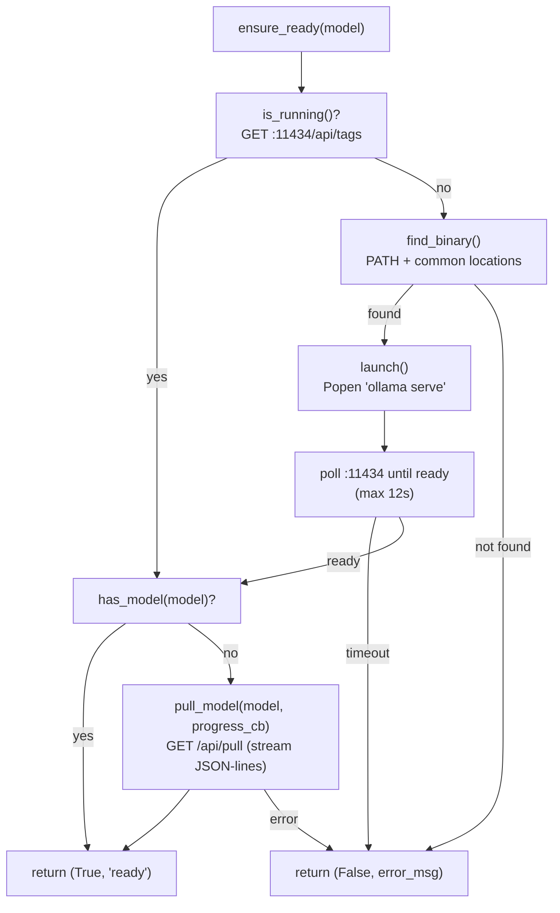

# OllamaManager — AgentBK-01

## Overview

`OllamaManager` (`app/agent/ollama_manager.py`) ทำให้ AgentBK **ใช้งานได้ทันที** โดยไม่ต้อง:
- เปิด Ollama daemon ก่อน
- รัน `ollama pull <model>` เอง

เมื่อแอปเริ่ม, `AgentRouter` เรียก `ensure_ready()` ใน background thread (init step 1/4)
ซึ่งจะ: ตรวจสอบ Ollama → เปิดถ้าไม่ได้รัน → pull model ถ้ายังไม่มี

---

## Architecture



---

## API Reference

### Constants

```python
DEFAULT_MODEL = "qwen2.5:3b"   # 2GB, tool-calling capable
```

### `is_running(timeout=1.5) -> bool`

ส่ง GET ไปที่ `http://localhost:11434/api/tags` ด้วย timeout สั้นๆ
คืน `True` ถ้า Ollama ตอบสนอง

```python
if ollama_manager.is_running():
    print("Ollama is already up")
```

---

### `find_binary() -> str | None`

ค้นหา Ollama binary ตามลำดับ:

| Platform | Paths |
|----------|-------|
| macOS/Linux | `PATH` → `/usr/local/bin/ollama` → `~/.ollama/bin/ollama` |
| Windows | `PATH` → `%LOCALAPPDATA%\Programs\Ollama\ollama.exe` → `%ProgramFiles%\Ollama\ollama.exe` |

คืน `None` ถ้าไม่พบ (Ollama ไม่ได้ติดตั้ง)

---

### `launch(timeout=12.0) -> bool`

เปิด Ollama daemon ด้วย `subprocess.Popen(["ollama", "serve"])` แบบ detached
แล้ว poll `is_running()` ทุก 0.5s จนกว่าจะ ready หรือ timeout

```python
if not ollama_manager.is_running():
    ok = ollama_manager.launch()
    if not ok:
        print("Failed to start Ollama")
```

---

### `list_models() -> list[str]`

เรียก `GET /api/tags` และแปลงผลเป็น list ของชื่อ model

```python
models = ollama_manager.list_models()
# ["qwen2.5:3b", "llama3.2:3b", ...]
```

---

### `has_model(name: str) -> bool`

ตรวจว่า model ชื่อ `name` อยู่ใน `list_models()` แล้ว

---

### `pull_model(name: str, progress_cb=None) -> bool`

Pull model จาก Ollama registry ด้วย streaming JSON-lines response

```
POST /api/pull  →  {"name": "qwen2.5:3b", "stream": true}
```

Response แต่ละ line:
```json
{"status": "pulling manifest"}
{"status": "pulling", "digest": "sha256:...", "completed": 512, "total": 2048}
{"status": "success"}
```

`progress_cb(text: str, fraction: float)` จะถูกเรียกทุก line
เพื่อส่ง progress ไปแสดงใน loading overlay

---

### `ensure_ready(model=DEFAULT_MODEL, progress_cb=None) -> tuple[bool, str]`

Pipeline หลัก — เรียกตามลำดับ:
1. `is_running()` → ถ้าไม่รัน → `find_binary()` → `launch()`
2. `has_model(model)` → ถ้าไม่มี → `pull_model(model, progress_cb)`
3. return `(True, "ready")` หรือ `(False, error_message)`

---

## Integration with AgentRouter

```python
# app/agent/router.py
def _preflight_ollama(self):
    """Runs in daemon thread — step 1 of 4-step init."""
    if os.getenv("ACTIVE_PROVIDER", "ollama") != "ollama":
        self._mark_init_step_done("Ollama (skipped)")
        return

    def _progress(text: str, frac: float):
        self._result_queue.put(_Chunk(kind="ollama_progress", text=text, frac=frac))

    model = os.getenv("OLLAMA_MODEL", DEFAULT_MODEL)
    ok, msg = ensure_ready(model=model, progress_cb=_progress)

    if not ok:
        self._result_queue.put(_Chunk(kind="error", text=f"Ollama: {msg}"))
    self._mark_init_step_done("Ollama")
```

### Chunk kinds ที่เกี่ยวข้อง

| Kind | ข้อมูล | ใช้ทำอะไร |
|------|--------|-----------|
| `ollama_progress` | `text` = status string, `frac` = 0.0-1.0 | แสดง progress bar ใน loading overlay |
| `init_progress` | `text` = "Ollama ready 1/4" | อัปเดต step counter |
| `error` | `text` = error message | แสดง error ถ้า Ollama fail |

---

## Loading Overlay — Progress Bar

`MainScene._draw_loading_overlay()` แสดง download progress bar เมื่อ `_ollama_frac > 0`:

```
┌──────────────────────────────────┐
│  ●●●◦  Initializing...           │
│                                  │
│  Pulling qwen2.5:3b...           │
│  ████████████░░░░░░░░  512/2048MB│
└──────────────────────────────────┘
```

Bar สี: `(70, 140, 220)` บน track `(40, 40, 60)`, border_radius=4

---

## Settings — Dynamic Model Refresh

Settings scene มีปุ่ม ↻ สำหรับ Ollama provider:

```python
def _refresh_ollama_models(self):
    live = ollama_manager.list_models()      # query running Ollama
    merged = list(dict.fromkeys([            # dedupe, preserve order
        *live, *_MODELS["ollama"]
    ]))
    _MODELS["ollama"] = merged
```

Ollama card ใน settings สูงกว่า provider อื่น (82px vs 58px) เพื่อรองรับ refresh button แถวพิเศษ

---

## Platform Support

| Platform | Auto-start | Notes |
|----------|-----------|-------|
| macOS | ✅ | `ollama serve` via PATH |
| Linux | ✅ | `ollama serve` via PATH |
| Windows | ✅ | ค้นหาใน `%LOCALAPPDATA%` + `%ProgramFiles%` |

> **Prerequisite**: ผู้ใช้ยังต้องติดตั้ง [Ollama](https://ollama.ai) เอง
> OllamaManager เปิด daemon และ pull model ให้ — แต่ไม่ได้ติดตั้ง Ollama แทนผู้ใช้

---

## Troubleshooting

| ปัญหา | สาเหตุ | วิธีแก้ |
|-------|--------|--------|
| "OllamaManager: binary not found" | ยังไม่ได้ติดตั้ง Ollama | ดาวน์โหลดจาก [ollama.ai](https://ollama.ai) |
| "OllamaManager: launch timeout" | Ollama เปิดช้า (บน HDD) | เพิ่ม `timeout` หรือเปิด Ollama เอง |
| Pull ค้างนาน | Model ใหญ่ / internet ช้า | ดู progress bar ใน loading overlay |
| Settings ↻ ไม่โชว์ model ใหม่ | Ollama ไม่ได้รัน | ตรวจสอบหน้าต่าง terminal / ลอง restart |

---

## See Also

- [01-architecture.md](01-architecture.md) — Initialization Sequence (4 Steps), Component Architecture
- [04-llm-providers.md](04-llm-providers.md) — OllamaProvider + Provider Selection Flow
- [05-dev-guide.md](05-dev-guide.md) — Setup + environment variables
